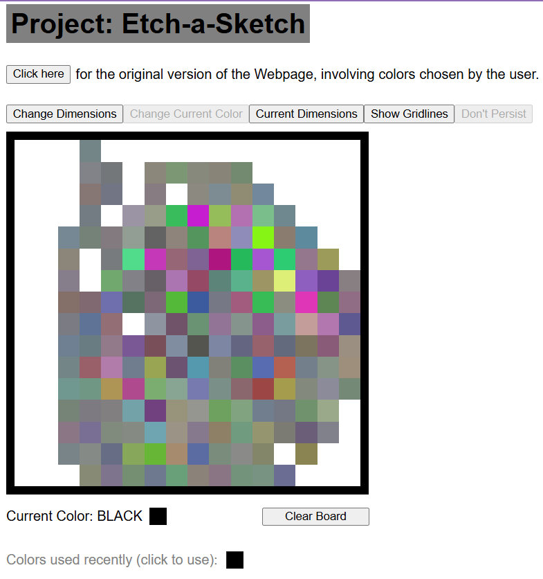

# <a src="https://www.theodinproject.com/lessons/foundations-etch-a-sketch">Project: Etch-a-Sketch</a>
(from The Odin Project)

This project is a part of the Foundations Course of "The Odin Project".

This project is in the form a single-page website. It initially contains a 16x16 grid of square divs. Whenever the cursor passes over the divs, a (pixelated) trail is left through the grid, like a pen over an Etch-a-Sketch board would.

A button on top of the screen, when pressed, sends a prompt that allows the user to specify the length of the square Grid. A limit of 100 is set so as to not allow the webpage to consume too many resources that could lead to delays, freezing or crashing. A new Grid with the dimensions specified in the prompt by the user, fills the same space occupied by the existing Grid, thereby creating a fresh, new 'Board'. There is a provision that allows the user to select a color of his/her choice which the cursor leaves a trail of, on the Grid.

Another challenge of the webpage randomizes the color of the trail left by the user's cursor and also implements a progressive darkening effect with each cursor interaction. A total of 10 interactions with a particular pixel (div) in the Grid would result in it being completely colored.

# Screenshots

